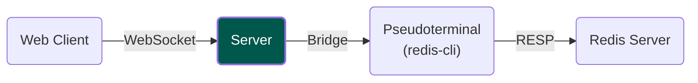

# Redis Web Terminal

A web-based terminal client for [my implementation of Redis](https://github.com/zorridge/redis-web-terminal).

```mermaid
flowchart LR
    client@{ shape: rounded, label: "Web Client" }
    server@{ shape: rounded, label: "Server" }
    pty@{ shape: rounded, label: "Pseudoterminal\n(redis-cli)" }
    redis@{ shape: rounded, label: "Redis Server" }

    client -- "WebSocket" --> server
    server -- "Bridge" --> pty
    pty -- "RESP" --> redis

    classDef core fill:#00574b,stroke-width:2px,color:#fff;
    server:::core
```
